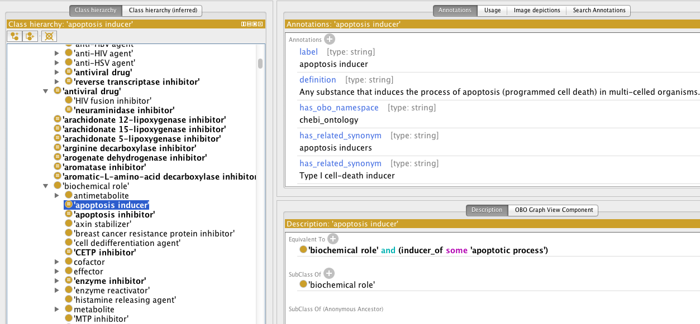

## CHEBI Integrated Role Ontology

An axiomatization of the CHEBI role branch that connects roles (and
thus chemicals) to:

 * GO
 * PRO
 * NCBITaxon
 * HP
 * DOID

## Background

CHEBI provides a distinct role hierarchy. Chemicals in the structural
hierarchy are connected via a 'has role' relation.

CHIRO provides links from these roles to useful other classes in other
ontologies. This will allow direct connection between chemical
structures (small molecules, drugs) and what they do. This could be
formalized using 'capable of', in the same way Uberon and CL link
structures to processes.

## Examples

 * 'anti-rheumatic drug' = drug and inhibitor_of some mp:'rheumatoid arthritis'
 * 'anti-inflammator drug' = drug and inhibitor_of some go:'inflammatory response'
 * 'estrogen receptor activity' = drug and inhibitor_of some go:'estrogen receptor activity'

See screenshots below for more examples

## Uses

This provides connections between CHEBI and other OBO ontologies.

It's ot clear if the same information could be obtained by other
sources, e.g. DrugBank, and the extent to which the relationships
would overlap.

## Formalism

We use ad-hoc relations for now:

 * activator_of
 * agonist_of
 * antagonist_of
 * destabilizer_of
 * inducer_of
 * inhibitor_of
 * modulator_of
 * sensitizer_of
 * stabilizier_of

These could be defined by expansion to something like

    (inheres_in some (capable_of some ({inhibits,activates} some X)))

This could in turn be collapsed to give axioms directly on the chemical structures

    capable_of some ({inhibits,activates} some X)

## Viewing

For now it's necessary to view in Protege

 * src/ontology/chiro-edit.owl

### Screenshots

Taken from Protege

